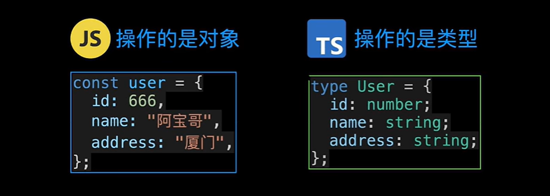

# 1、TS和JS的核心区别


TS是针对数据类型的，是用来定义数据类型和操作数据类型的。使用TS是为了减少代码错误，和写出更加便于管理的，更加健壮的代码。

JS是针对数据的，是用来定义数据和操作数据的。

2、区分TS普通类型和工具类型

把TS普通类型传入工具类型中

# 2、 如何创建一个 既有string又有number的数组？

```
// 书写格式如下，不要少括号，否则用作类型注解时，赋值给变量会报错
type T = (string|number)[]
```

# 3、TS内置的工具类型

```
Uppercase、Lowercase、Capitalize、Uncapitalize、pick、Omit、Exclude
```

###### ①Pick 工具类型

作用是选取对象中，被选中的属性，从而形成一个新的类型


###### ②Omit工具类型

作用是过滤掉对象中不需要的属性，从而形成一个新的类型


Omit类型的另一个应用场景：结合接口继承，来实现修改对象中的已知属性，从而形成新的类型


Omit工具类型的实现方式：使用到了TS内置的Exclude 和 Pick工具类型


 

# 1、泛型 （generics）


泛型就是指：在定义 函数，接口或者类的时候，我们使用泛型变量，不去指定具体的类型。等到我们`使用的时候再去指定具体类型的约束方式`。

# 2、联合类型

联合类型操作符 （|）,   联合类型指的是由两种或者多种类类型组合成的新的类型，用来约束值是这些类型中的一种。

# 3、交叉类型


交叉类型操作JavaScript，实现的效果，不同属性放到一起，有相同属性的就取其交集。


交叉类型操作函数，实现的效果类似于函数重载。


# 4、any类型和unknow类型


# 5、TS中的object类型

`object` 类型他表示非原始对象，`number`，`string`，`boolean`，`symbol`，`null`或`undefined`在JavaScript中为原始类型

# 6、 索引签名 和 Record 工具类型

当定义的对象的属性个数不确定时，就可以使用索引签名 和 Record工具类型

以下是索引签名的语法：


下面是模板字面量类型的写法


下面是Record类型的写法：


# 7、declare


报这样的错误的原因是，TS不认识wx这样的全局变量。（TS自己内置声明了许多全局变量，所以类似JSON这样的全局变量可以直接使用）

```
//解决办法就是 使用declare关键字声明 wx 全局变量，如下：
declare var wx ： any；
```

可以使用 https://www.typescriptlang.org/dt/search 这个网址，查找对应的已经写好的声明文件，导入到项目中使用。

# 8、泛型的 工具类型（pick）

pick的作用就是从一个对象中选取出几个指定的类型，组成一个新的类型。用法如下：


# 9、TS中 类型别名 type 和 接口 interface的区别

interface只能用于定义对象类型，可以同时声明对象上的属性和方法。


##### ①类型别名和接口都可以用来描述对象和函数


##### ②类型别名和接口都支持拓展，类型别名通过 交叉运算符来拓展，接口通过extends 来拓展。


##### ③类型别名可以为基本类型、联合类型或者元组类型定义别名，而接口不可以！

##### ④同名接口会自动合并，而同名类型别名则会报错。


# 10、函数和类中的重载

函数重载


类方法重载


# 11、TS中keyof操作符的应用（用来操作类型注解（类型））

 用于获取类型中的所有键，其返回类型是一个联合类型

##### ①直接操作类型，返回一个由操作类型的键的名称 组成的联合类型


##### ② 用类型包裹住 上面得到的联合类型，就可以获得由类型每个键的类型组合成的联合类型


③ keyof用在 类和枚举类型上


# 12、映射类型


 新的语法 as子句，对键值对的键进行重新映射。


# 13、TS中 typeof 操作符的应用（用来操作 js普通对象、函数对象、class类）

##### ①ts中可以使用 `typeof` 操作符，从普通JavaScript对象中提取类型注解。


##### ②ts中可以使用` keyof typeof `操作符组合，从枚举类型中提取类型注解。（提取到所以属性名）


#####  ③可以使用`typeof `操作符 ，来获取函数对象的类型注解。

​		有了函数对象的类型注解，还可以使用TS内置的ReturnType和Parameters工具来获取函数的返回值类型和参数类型的注解


④可以使用typeof操作符出来class，来获取到class中的构造函数对应的类型注解。


⑤ typeof还可以结合const断言，来提取更加精确的（缩小范围）类型注解。


# 14、定义工具类型 -- 使用条件类型

你知道 Exclude、Extract、NonNullable、Parameters、ReturnType等这些工具类型吗？

下图展示了TS中的工具类型是怎么定义的，工具类型返回的也是类型


上面这句话的理解是：当类型T可以赋值给类型U时，返回类型X，否则返回类型Y。

下图的条件链怎么理解？


​     条件链工具类型处理联合类型的情况如下图


# 15、infer

infer用于声明变量，用来存储 在模式匹配中所捕获到的类型 （所捕获到的类型不是确定的，根据每次模式匹配的类型来确定）

infer 声明的变量和普通变量的区别是：普通变量需要我们主动赋值，而infer变量是每次模式匹配中自动赋值的。

##### 如何获取一个数组的类型？

```tsx
// 1.自己创建一个工具类型(UnpackedArray),用于获取一个数组的返回值类型
type UnpackedArray<T> = T extends (infer U)[] ? U : T

//2. 使用UnpackedArray，来获取 TO 数组类型的类型。
type TO = (string | number)[]
type UO = UnpackedArray<TO>     
```

infer 使用的几个限制：


```
（1）infer声明只能在 extends之后使用，不能再extends之前或者其他地方使用.
（2）infer声明的类型变量只在True分支中可用。
（3）infer声明的类型变量，会在匹配过程中，根据extends前面的类型推导图同样的类型。
```

##### 如何获取一个函数的返回值类型？

```tsx
// 1.自己创建一个工具类型(UnpackedArray),用于获取一个函数的返回值类型
type UnpackedFn<T> = T extends (...args:any[])=> infer U ? U : T
```


# 16、infer 新特性


为infer type添加可选的 extends 子句，当infer types extends子句不成立是，表达式也同样为false

# 17、模板字面量类型

使用模板字面量类型来减少项目中的typescript重复代码


隐藏的叉积组合


# 20、TS中的extends（有多种含义，不要搞混）

##### ① 两个接口用extends来继承


##### ② 在泛型当中用extends来做约束


